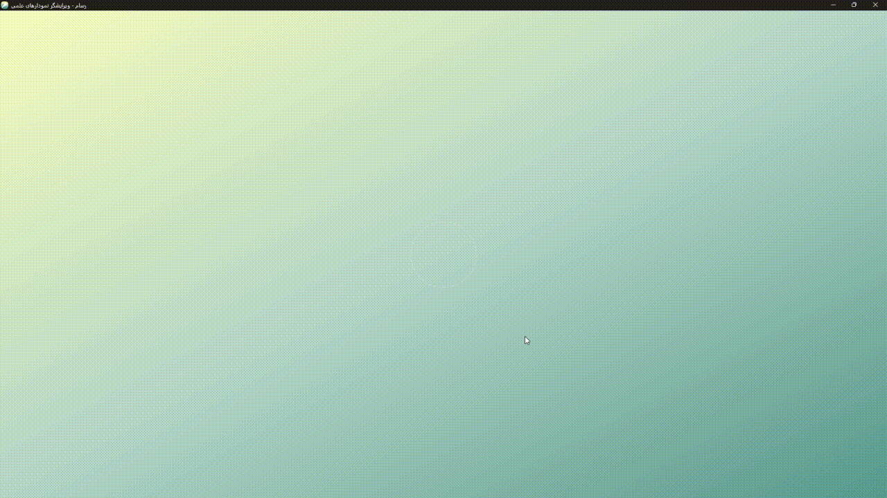

# رسام
## Demo


ویرایشگر نمودارهای علمی با قدرت [Mermaid](https://mermaid.js.org/). ساخت، استایل‌دهی و خروجی فلوچارت، نمودار توالی، نمودار کلاس، گانت و بیش از ۲۰ نوع نمودار دیگر -- کاملا آفلاین، در مرورگر یا به عنوان اپلیکیشن دسکتاپ مستقل.

## دانلود

برای دانلود به [صفحه Releases](https://github.com/A-talebifard/Rassam/releases) مراجعه کنید.

| پلتفرم | فایل | حجم |
|---|---|---|
| Windows x64 | `Rassam_x.x.x_x64-setup.exe` | حدود ۱۰ مگابایت |

نصب‌کننده با NSIS ساخته شده. فقط آن را اجرا کنید و مراحل نصب را دنبال کنید.

## ویژگی‌ها

- **بیش از ۲۵ نوع نمودار** -- فلوچارت، نمودار توالی، نمودار کلاس، نمودار وضعیت، نمودار ER، نمودار گانت، تایم‌لاین، سفر کاربر، نمودار دایره‌ای، نقشه ذهنی، نمودار Git، نمودار معماری، C4، نمودار نیازمندی، کانبان، ایشیکاوا، سانکی، رادار، XY، treemap، ون، واردلی، نمودار چارئربخش و بیشتر (شامل انواع بتا).
- **پیش‌نمایش زنده** -- کد Mermaid را در سمت چپ ویرایش کنید و نمودار رندر شده را در سمت راست به صورت لحظه‌ای ببینید.
- **ویرایشگر استایل** -- سفارشی‌سازی رنگ پرکردن، حاشیه، رنگ متن، شفافیت گره‌ها و رنگ/ضخامت اتصالات برای هر عنصر.
- **پریست‌های استایل** -- ذخیره و استفاده مجدد از تنظیمات استایل. وارد/صادر کردن پریست‌ها به صورت JSON.
- **حالت شب و روز** -- تغییر بین تم تاریک عمیق و تم روشن از پنل تنظیمات. پیش‌نمایش نمودار به طور خودکار تم Mermaid را تطبیق می‌دهد.
- **راست‌چین و چپ‌چین** -- تغییر جهت متن نمودار در تنظیمات.
- **فونت‌های سفارشی** -- بارگذاری فایل‌های فونت محلی (TTF, OTF, WOFF, WOFF2) و استفاده از آنها در نمودارها.
- **مدیریت پروژه** -- ذخیره، بارگذاری، وارد و صادر کردن پروژه‌ها. تمام داده‌ها در localStorage ذخیره می‌شوند (بدون نیاز به سرور).
- **کتابخانه قالب** -- ۲۵ قالب داخلی دسته‌بندی شده. ذخیره قالب‌های شخصی و وارد/صادر کردن آنها.
- **خروجی** -- خروجی نمودارها به صورت SVG، PNG یا PDF با DPI و رنگ پس‌زمینه قابل تنظیم.
- **آفلاین** -- بدون نیاز به اینترنت. تمام وابستگی‌ها به صورت محلی بسته‌بندی شده‌اند.
- **اپلیکیشن دسکتاپ** -- ساخته شده با Tauri v2 برای یک فایل اجرایی مستقل و سبک (حدود ۱۰ مگابایت در ویندوز).

## تکنولوژی‌ها

| فناوری | ابزار |
|---|---|
| فریمورک | Next.js 16 (App Router, static export) |
| زبان | TypeScript 5 |
| استایل | Tailwind CSS 4 + shadcn/ui |
| نمودارها | Mermaid v11 |
| خروجی PDF | jsPDF |
| دسکتاپ | Tauri v2 |
| وضعیت | React hooks + localStorage |

## شروع کار (توسعه)

### پیش‌نیازها

- Node.js 18+
- npm (پیشنهاد می‌شود؛ bun ممکن است در ویندوز مشکل ایجاد کند)
- ابزار Rust + Tauri CLI (فقط برای بیلد دسکتاپ)

### نصب وابستگی‌ها

```bash
npm install
```

### اجرای سرور توسعه

```bash
npm run dev
```

آدرس `http://localhost:3000` را در مرورگر باز کنید.

### بیلد خروجی استاتیک

```bash
npm run build
```

خروجی در پوشه `out/` تولید می‌شود. با هر سرور فایل استاتیک قابل سرویس‌دهی است.

### بیلد اپ دسکتاپ (ویندوز)

```bash
npm run tauri:build
```

این دستور:
1. خروجی استاتیک Next.js را در `out/` می‌سازد
2. اسکریپت postbuild را برای کپی فایل‌های عمومی اجرا می‌کند
3. اپلیکیشن دسکتاپ Tauri را کامپایل می‌کند
4. فایل نصبی را در پوشه `release/` کپی می‌کند

بعد از بیلد، فایل نصبی در مسیر زیر قرار دارد:

```
release/Rassam_x.x.x_x64-setup.exe
```

این فایل را در GitHub Release آپلود کنید.

## ساختار پروژه

```
rassam/
  src/
    app/
      page.tsx          # اپلیکیشن اصلی
      layout.tsx        # لایه‌آت ریشه
      globals.css       # استایل‌های عمومی، حالت شب
    components/ui/      # کامپوننت‌های UI
  src-tauri/
    src/lib.rs          # نقطه ورود Tauri
    tauri.conf.json     # تنظیمات Tauri
    capabilities/       # دسترسی‌های Tauri
  public/
    icon.png            # آیکون اپلیکیشن
    fonts/              # فونت‌های بسته‌بندی شده
  scripts/
    postbuild.js        # کپی پس از بیلد
    copy-release.js     # کپی نصبی به release/
```

## پیکربندی

تمام ترجیحات کاربر در localStorage ذخیره می‌شود:

| کلید | توضیحات |
|---|---|
| `rassam-projects` | پروژه‌های ذخیره شده |
| `rassam-templates` | قالب‌های سفارشی |
| `rassam-dark-mode` | حالت شب/روز |
| `mermaid-custom-fonts` | فونت‌های سفارشی |

## مجوز

این پروژه متن‌باز است. برای جزئیات به [مخزن GitHub](https://github.com/A-talebifard/Rassam) مراجعه کنید.

---

قدرت گرفته از [Mermaid](https://mermaid.js.org/)

---

---

# Rassam

A scientific diagram editor powered by [Mermaid](https://mermaid.js.org/). Create, style, and export flowcharts, sequence diagrams, class diagrams, Gantt charts, and 20+ other diagram types -- all offline, all in your browser or as a standalone desktop app.

## Download

Go to the [Releases page](https://github.com/A-talebifard/Rassam/releases) and download the latest version.

| Platform | File | Size |
|---|---|---|
| Windows x64 | `Rassam_x.x.x_x64-setup.exe` | ~10 MB |

The installer is built with NSIS. Just run it and follow the setup wizard.

## Features

- **25+ Diagram Types** -- Flowcharts, sequence diagrams, class diagrams, state diagrams, ER diagrams, Gantt charts, timelines, user journeys, pie charts, mind maps, Git graphs, architecture diagrams, C4 context, requirement diagrams, Kanban boards, Ishikawa, Sankey, radar, XY charts, treemaps, Venn, Wardley, quadrant charts, and more (including beta types).
- **Live Preview** -- Edit Mermaid code on the left, see the rendered diagram on the right in real time.
- **Style Editor** -- Customize node fill, stroke, text color, opacity, and link colors/stroke width for individual elements.
- **Style Presets** -- Save and reuse style configurations. Import/export presets as JSON.
- **Dark & Light Mode** -- Toggle between a deep dark theme and a clean light theme from the Settings panel. The diagram preview automatically adapts its Mermaid theme.
- **RTL & LTR Text Direction** -- Switch diagram text direction in Settings.
- **Custom Fonts** -- Load local font files (TTF, OTF, WOFF, WOFF2) and use them in diagrams.
- **Project Management** -- Save, load, import, and export projects. All data stored in localStorage (no server required).
- **Template Library** -- 25 built-in templates organized by category. Save your own templates and import/export them.
- **Export** -- Export diagrams as SVG, PNG, or PDF with configurable DPI and background color.
- **Offline First** -- No internet connection required. All dependencies are bundled locally.
- **Desktop App** -- Built with Tauri v2 for a lightweight standalone executable (~10 MB on Windows).

## Tech Stack

| Technology | Tool |
|---|---|
| Framework | Next.js 16 (App Router, static export) |
| Language | TypeScript 5 |
| Styling | Tailwind CSS 4 + shadcn/ui |
| Diagrams | Mermaid v11 |
| PDF Export | jsPDF |
| Desktop | Tauri v2 |
| State | React hooks + localStorage |

## Getting Started (Development)

### Prerequisites

- Node.js 18+
- npm (recommended; bun may cause Turbopack resolution issues on Windows)
- Rust toolchain + Tauri CLI (only needed for desktop builds)

### Install Dependencies

```bash
npm install
```

### Run Development Server

```bash
npm run dev
```

Open `http://localhost:3000` in your browser.

### Build Static Export

```bash
npm run build
```

Output is generated in the `out/` directory. Serve it with any static file server.

### Build Desktop App (Windows)

```bash
npm run tauri:build
```

This command:
1. Builds the Next.js static export to `out/`
2. Runs the postbuild script to copy public assets
3. Compiles the Tauri desktop app
4. Copies the installer to the `release/` folder

After the build, the installer will be at:

```
release/Rassam_x.x.x_x64-setup.exe
```

Upload this file to your GitHub Release.

## Project Structure

```
rassam/
  src/
    app/
      page.tsx          # Main application
      layout.tsx        # Root layout with fonts and toaster
      globals.css       # Global styles, dark mode, splash animations
    components/ui/      # shadcn/ui components
  src-tauri/
    src/lib.rs          # Tauri entry point
    tauri.conf.json     # Tauri configuration
    capabilities/       # Tauri permissions (shell:allow-open)
  public/
    icon.png            # App icon (1080x1080)
    fonts/              # Bundled fonts (Vazirmatn)
  scripts/
    postbuild.js        # Copies public assets to out/ after build
    copy-release.js     # Copies installer to release/ folder
```

## Configuration

All user preferences are stored in localStorage:

| Key | Description |
|---|---|
| `rassam-projects` | Saved projects |
| `rassam-templates` | Custom templates |
| `rassam-dark-mode` | Dark/light mode preference |
| `mermaid-custom-fonts` | Custom uploaded fonts |

## License

This project is open source. See the [GitHub repository](https://github.com/A-talebifard/Rassam) for details.

---

Powered by [Mermaid](https://mermaid.js.org/)
